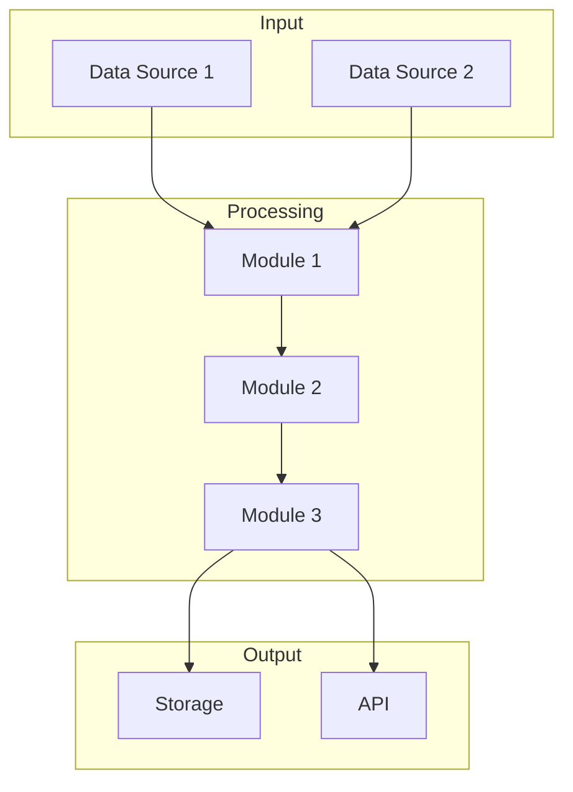
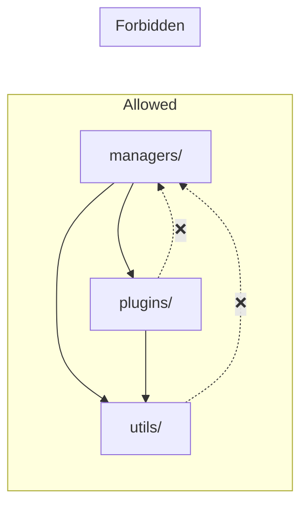

# {Project Name} Architecture

> **Vision:** [vision.md](./vision.md)  
> **Created:** {YYYY-MM-DD}  
> **Status:** 📐 Draft | ✅ Approved

---

## When This Document is Required

<!--
Include this document if ANY of these are true:
- Project has ≥3 custom modules
- Cross-module data flows exist
- External API integrations beyond simple calls
- Async/background processing
- Team size > 1 person

If 2+ conditions are true, this document is MANDATORY.
-->

---

## System Diagram

<!-- 
CONSTRAINT: Must fit in one screen.
Use Mermaid for maintainability.
-->



---

## Component Responsibilities

<!-- 
One paragraph per component. Focus on WHAT it does, not HOW.
Implementation details belong in implementation.md.
-->

### {Component/Module Name}

**Type:** Manager | Util | Plugin | MCP

**Responsibility:** {What this component does in one sentence.}

**Inputs:** {What it receives}

**Outputs:** {What it produces}

---

### {Component/Module Name}

**Type:** Manager | Util | Plugin | MCP

**Responsibility:** {One sentence.}

**Inputs:** {What it receives}

**Outputs:** {What it produces}

---

## Data Flow

<!-- 
Show the journey of data through the system.
Use a table or diagram.
-->

```
Input → [Stage 1] → [Stage 2] → [Stage 3] → Output

Example:
Raw Data → Download → Preprocess → Store → Query → Display
```

### Stage Details

| Stage | Input | Transformation | Output | Owner |
|-------|-------|----------------|--------|-------|
| {Stage name} | {Input format} | {What happens} | {Output format} | `{module}` |
| {Stage name} | {Input format} | {What happens} | {Output format} | `{module}` |

---

## Integration Points

<!-- 
External systems, APIs, file formats, protocols.
-->

### External APIs

| Service | Purpose | Auth Method | Rate Limits |
|---------|---------|-------------|-------------|
| {Service name} | {Why we use it} | {API key/OAuth/etc} | {Limits if any} |

### File Formats

| Format | Used For | Schema Location |
|--------|----------|-----------------|
| {Format} | {Purpose} | {Link or path} |

### Protocols

| Protocol | Used For | Port/Endpoint |
|----------|----------|---------------|
| {Protocol} | {Purpose} | {Details} |

---

## Module Boundaries

<!-- 
Which modules can call which? What are the dependency rules?
-->



### Dependency Rules

1. **Managers** can depend on: utils, plugins
2. **Plugins** can depend on: utils
3. **Utils** must be stateless — no dependencies on managers or plugins
4. **MCPs** can depend on: managers, utils

---

## State Management

<!-- 
Where does state live? What's cached? What's persistent?
-->

| State | Storage | Lifetime | Owner |
|-------|---------|----------|-------|
| {State type} | {Where stored} | {Session/Persistent/Cache} | `{module}` |

---

## Error Handling Strategy

<!-- 
High-level error handling philosophy.
-->

| Error Type | Strategy | Example |
|------------|----------|---------|
| Transient (network) | Retry with backoff | API timeouts |
| Permanent (bad data) | Log and skip | Invalid file format |
| Critical (system) | Fail fast, alert | Database unavailable |

---

<!--
ARCHITECTURE NOTES:

This document answers:
- "What are the major components?"
- "How do they interact?"
- "What are the boundaries and rules?"

This document does NOT:
- Define task sequences (see implementation.md)
- Specify exact APIs (implementation detail)
- Track progress (see implementation.md)

Update this document when:
- New module is added
- Integration point changes
- Data flow is restructured
-->
