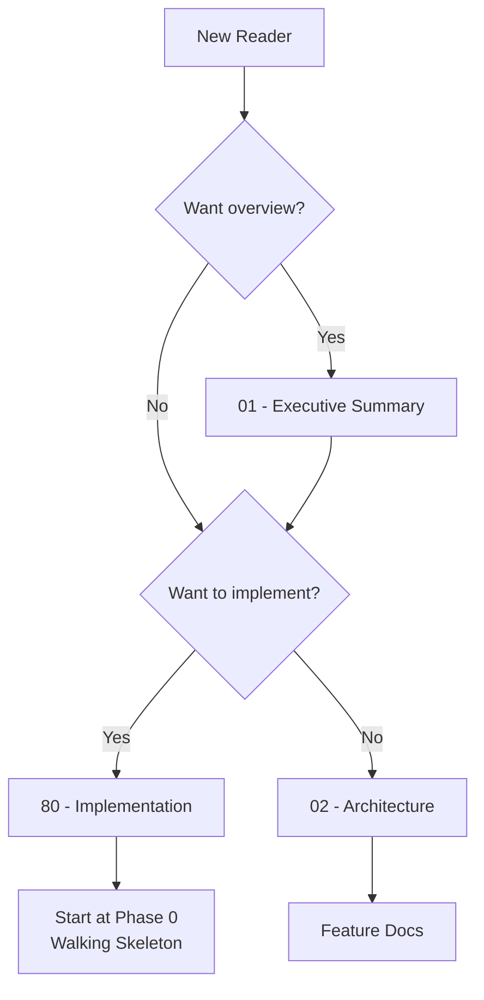

# 🎯 {Project Name}: Project Blueprint

> *{Vision statement — one emotional sentence capturing the project's soul}*

**Document Type:** Technical Design Document / Project Blueprint  
**Version:** 1.0  
**Created:** {YYYY-MM-DD}  
**Status:** 📐 Planning | 🚧 In Progress | ✅ Complete

---

## 📊 Progress Overview

| Phase | Status | Notes |
|-------|--------|-------|
| P0: Walking Skeleton | ⏳ | {Brief status note} |
| P1: {Phase Name} | ⏳ | {Brief status note} |
| P2: {Phase Name} | ⏳ | {Brief status note} |

### Status Legend

| Icon | Meaning |
|------|---------|
| ⏳ | TODO |
| 🔄 | WIP |
| ✅ | DONE |
| 🚫 | CUT |

---

## 📐 Planning Standards

This blueprint follows **HyperDream phasing rules**:

| Principle | Meaning |
|-----------|---------|
| **Walking Skeleton First** | Phase 0 proves plumbing works with hardcoded stubs |
| **Difficulty Honesty** | Each item labeled `[KNOWN]`, `[EXPERIMENTAL]`, or `[RESEARCH]` |
| **Research ≠ Foundation** | `[RESEARCH]` items never in Phase 0 |
| **Incremental Value** | Each phase delivers usable functionality |

---

## 📑 Document Index

| # | Document | Required | Description |
|---|----------|----------|-------------|
| 00 | [Index](./00_index.md) | ✓ | This file — overview and navigation |
| 01 | [Executive Summary](./01_executive_summary.md) | ✓ | Goals, non-goals, success metrics |
| 02 | [Architecture](./02_architecture.md) | ✓ | High-level system design |
| 03 | [Feature: {Name}](./03_feature_{name}.md) | | {Brief description} |
| 04 | [Feature: {Name}](./04_feature_{name}.md) | | {Brief description} |
| 80 | [Implementation](./80_implementation.md) | ✓ | Phase roadmap and task tracking |
| 99 | [References](./99_references.md) | | External links and documentation |

<!-- 
REQUIRED documents: 00, 01, 02, 80_implementation (4 minimum)
OPTIONAL documents: Feature docs (03-79), References

Add/remove feature docs as needed. 80/99 prefix = fixed bottom sorting.
Typical ordering: features 03-79, implementation 80, references 99
-->

---

## 💭 Vision Statement

> *"{Expanded vision — 2-3 sentences describing what this project is, who it's for, and why it matters. This should make someone excited to read more.}"*

---

## �� Quick Links

- **Start Here:** [Executive Summary](./01_executive_summary.md)
- **Technical Deep Dive:** [Architecture](./02_architecture.md)
- **Implementation:** [Roadmap](./80_implementation.md)

---

## 🏁 Where to Start

---

**Last Updated:** {YYYY-MM-DD}

---

**← Back to:** [Templates Index](../00_index.md)
