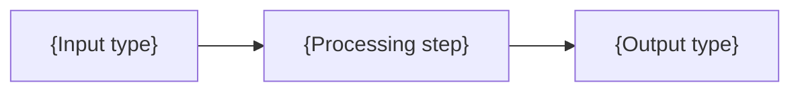
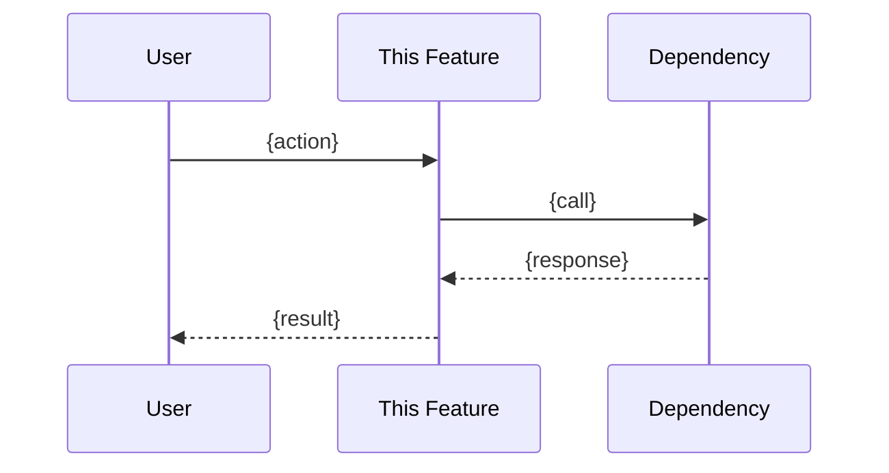

<!--
╔═══════════════════════════════════════════════════════════════════════════════╗
║                         FIXED SECTION NAMES                                   ║
║  Do NOT rename these sections - they are used for cross-referencing:          ║
║                                                                               ║
║  REQUIRED:        🎯 Overview, 👥 User Stories, ✅ Acceptance Criteria        ║
║  STANDARD:        🗺️ System Context, 📊 Data Flow, 🔗 Integration Points,     ║
║                   🛠️ Technical Notes, ⚠️ Edge Cases, ❌ Out of Scope,         ║
║                   🔗 Dependencies, ❓ Open Questions, 🖼️ Related Assets       ║
║                                                                               ║
║  CUSTOM SECTIONS: Use "## [Custom] Your Title" prefix for project-specific    ║
║                   sections (max 5 custom sections per document)               ║
║                                                                               ║
║  FREE ZONES:      Look for FREE ZONE markers where you can add                ║
║                   content without following strict templates                  ║
╚═══════════════════════════════════════════════════════════════════════════════╝
-->

# NN - Feature: {Feature Name}

> Part of [{Project Name} Blueprint](./00_index.md)

---

## 🎯 Overview

<!-- 
Expanded description of the feature.
This is the "appendix" for features that exceeded the 5-line limit in executive summary.
-->

{2-3 paragraphs describing the feature in detail.}

**Priority:** P0 | P1 | P2  
**Difficulty:** `[KNOWN]` | `[EXPERIMENTAL]` | `[RESEARCH]`

---

<!-- OPTIONAL: Use when feature touches ≥3 modules or has external integrations -->
## 🗺️ System Context

<!-- 
Show where this feature lives in the overall system.
Mermaid preferred, ASCII acceptable for simple cases.
-->

```mermaid
flowchart LR
    subgraph "This Feature"
        F[{Feature}]
    end
    
    A[Upstream Module] --> F
    F --> B[Downstream Module]
    F <--> C[External API]
```

---

<!-- OPTIONAL: Use when data transformation is non-trivial -->
## 📊 Data Flow

<!-- Input → Processing → Output for this feature -->



| Stage | Format | Example |
|-------|--------|---------|
| Input | {format} | `{example}` |
| Output | {format} | `{example}` |

---

<!-- ═══════════════════════════════════════════════════════════════════════ -->
<!-- FREE ZONE START - Add custom sections below using "## [Custom] 🎨 Title"-->
<!--                                                                         -->
<!-- Maximum 5 custom sections. This is YOUR space for thinking that doesn't -->
<!-- fit standard templates. Be creative. Be honest. Be useful.              -->
<!--                                                                         -->
<!-- 📐 STRUCTURAL EXAMPLES:                                                 -->
<!--   ## [Custom] 📊 Performance Benchmarks                                 -->
<!--   ## [Custom] 🔄 Migration Strategy                                     -->
<!--   ## [Custom] 🧪 A/B Testing Plan                                       -->
<!--   ## [Custom] 📈 Success Metrics                                        -->
<!--   ## [Custom] 🔐 Security Considerations                                -->
<!--                                                                         -->
<!-- 🧠 THINKING TOOLS (for complex decisions):                              -->
<!--   ## [Custom] ⚖️ Philosophical Tensions — Contradictions you're         -->
<!--        navigating (speed vs accuracy, simplicity vs power)              -->
<!--   ## [Custom] ⚰️ Assumption Graveyard — Risky bets that could kill      -->
<!--        the feature if wrong (with early validation strategy)            -->
<!--   ## [Custom] 🎭 Metaphor Map — Analogies that explain the system       -->
<!--        to different audiences (devs, users, stakeholders)               -->
<!--   ## [Custom] 🔮 Future Regret Analysis — "What will we wish we had     -->
<!--        done differently in 6 months?"                                   -->
<!--   ## [Custom] 🐘 Uncomfortable Questions — Things nobody wants to       -->
<!--        ask but everyone should (scaling, maintenance burden, etc.)      -->
<!--   ## [Custom] 📜 Decision Log — Key choices made and WHY (not just what)-->
<!--                                                                         -->
<!-- 🎯 SCOPE & BOUNDARIES:                                                  -->
<!--   ## [Custom] 🚧 Scope Fences — Hard lines that prevent scope creep     -->
<!--   ## [Custom] 🎰 Feature Lottery — Ideas we're NOT doing (but could)    -->
<!--   ## [Custom] ⏰ Time Bombs — Technical debt we're knowingly creating   -->
<!--                                                                         -->
<!-- See: templates/examples/free_zone_*.example.md for real examples        -->
<!-- ═══════════════════════════════════════════════════════════════════════ -->


<!-- ═══════════════════════════════════════════════════════════════════════ -->
<!-- FREE ZONE END                                                           -->
<!-- ═══════════════════════════════════════════════════════════════════════ -->

---

## 🔗 Integration Points

| Connects To | Direction | Data | Protocol |
|-------------|-----------|------|----------|
| `{module/service}` | → OUT | {What is sent} | {REST/gRPC/File/Event} |
| `{module/service}` | ← IN | {What is received} | {REST/gRPC/File/Event} |
| `{module/service}` | ↔ BOTH | {Bidirectional data} | {Protocol} |

---

## 👥 User Stories

| As a... | I want to... | So that... |
|---------|--------------|------------|
| {User type} | {Action} | {Benefit} |
| {User type} | {Action} | {Benefit} |

---

## ✅ Acceptance Criteria

<!-- 
Detailed criteria for this feature to be considered complete.
-->

- [ ] {Criterion 1 — specific and testable}
- [ ] {Criterion 2 — specific and testable}
- [ ] {Criterion 3 — specific and testable}

---

## 🛠️ Technical Notes

### Constraints

- {Technical constraint 1}
- {Technical constraint 2}

### Considerations

- {Thing to think about during implementation}

---

## ⚠️ Edge Cases

| Scenario | Expected Behavior |
|----------|-------------------|
| {Edge case description} | {What should happen} |
| {Edge case description} | {What should happen} |

---

## ❌ Out of Scope

<!-- What this feature explicitly does NOT include. -->

- {Thing that's not part of this feature}
- {Thing deferred to a later phase}

---

## 🔗 Dependencies

| Dependency | Status | Notes |
|------------|--------|-------|
| {Feature/Module} | {Done/Pending} | {Notes} |

---

## 🖼️ Related Assets

<!-- 
Link to non-code artifacts (mockups, diagrams, storyboards) that support this feature.
Assets are stored in ../assets/ folder.
-->

| Asset | Type | Status | Description |
|-------|------|--------|-------------|
| [{Feature ID}_{description}.asset.md](../assets/{feature_id}_{description}.asset.md) | mockup/diagram/etc | 📐 Draft | {Brief description} |

---

## ❓ Open Questions

- {Question 1}
- {Question 2}

---

<!-- 
═══════════════════════════════════════════════════════════════════════════════
OPTIONAL SECTION: 🔬 Deep Dive

⚠️  DEEP DIVE vs FREE ZONE — KNOW THE DIFFERENCE:

    FREE ZONE is for CONCEPTUAL thinking:
    - Philosophical tensions, metaphors, assumptions
    - Strategic decisions, scope fences, future regrets
    - Things you'd explain in a meeting

    DEEP DIVE is for RIGOROUS TECHNICAL ARTIFACTS:
    - UML diagrams (class, sequence, state machine) in Mermaid
    - Mathematical proofs with complexity analysis (Big-O, LaTeX)
    - Benchmark tables with actual measured numbers
    - Weighted trade-off matrices with scoring formulas
    - Migration timelines (Gantt charts)
    - Data schema evolution (v1 → v2 → v3 with column maps)
    - Folder structure diagrams with file responsibilities
    - Dependency graphs showing module relationships
    - Circuit breaker configurations, rollback strategies
    - Error propagation analysis with failure modes
    - Things you'd draw on a WHITEBOARD with precision

WHEN TO USE DEEP DIVE:
- Algorithm choices need Big-O analysis, benchmarks, or correctness proofs
- Architecture requires class diagrams showing ≥5 classes with relationships
- Migration needs phased timeline with rollback triggers
- Performance requires actual measured numbers, not estimates
- Multiple implementations compared with weighted scoring matrix
- State machines have ≥4 states with complex transitions
- API evolution spans ≥2 versions with schema changes

WHEN TO DELETE (use FREE ZONE or Technical Notes instead):
- Feature is straightforward with no algorithmic complexity
- A simple table or bullet list captures the tradeoffs
- No need for diagrams, proofs, or benchmarks
- Implementation path is obvious from Overview + Technical Notes

EXPECTED DEPTH: 60-280 lines per Deep Dive section
If your Deep Dive is <40 lines, it probably belongs in Technical Notes or FREE ZONE.

If you keep this section, remove these comments and fill in relevant subsections.
If you delete this section, also remove it from the FIXED SECTIONS comment at bottom.
═══════════════════════════════════════════════════════════════════════════════
-->

## 🔬 Deep Dive

<!-- 
═══════════════════════════════════════════════════════════════════════════════
This section is for RIGOROUS TECHNICAL ARTIFACTS that require precision.
These are NOT conceptual discussions — they are engineering documentation.

🎯 LITMUS TEST: "Would this require a whiteboard with diagrams and numbers?"
   If yes → Deep Dive is warranted. If just discussion → use FREE ZONE.

⚠️  MINIMUM DEPTH: 60 lines. If you can express it in <40 lines, 
    it belongs in Technical Notes or FREE ZONE.

📂 EXAMPLE FILES (see templates/examples/):

  COMPREHENSIVE ARCHITECTURE (80-120 lines):
  • deep_dive_comprehensive_architecture.example.md
    - Class diagrams (Mermaid) showing ≥5 classes with relationships
    - Sequence diagrams for complex multi-step flows
    - Folder structure with file responsibilities table
    - Dependency graphs (internal + external)
    - Capacity planning calculations with actual numbers

  MIGRATION STRATEGY (80-120 lines):
  • deep_dive_migration_strategy.example.md
    - Gantt timeline with phases and milestones
    - Before/After state diagrams
    - Data schema evolution (v1 → v2 with column mappings)
    - Rollback strategy with trigger conditions
    - Risk matrix with probability × impact scoring

  ALGORITHM ANALYSIS (60-100 lines):
  • deep_dive_algorithm_proof.example.md
    - Complexity proofs with Big-O and LaTeX formulas
    - Benchmark tables with measured numbers (not estimates)
    - Weighted trade-off matrix with scoring formula
    - Decision tree for algorithm selection
    - Edge case table with failure modes and mitigations

  EXISTING EXAMPLES (40-80 lines):
  • deep_dive_algorithm_choices.example.md — Algorithm comparison + benchmarks
  • deep_dive_api_contract.example.md — API spec with schemas + versioning
  • deep_dive_error_handling.example.md — Error taxonomy + recovery strategies
  • deep_dive_migration_runbook.example.md — Step-by-step migration guide
  • deep_dive_state_machine.example.md — State diagrams + transition tables

Choose appropriate subsections below based on your feature's complexity.
═══════════════════════════════════════════════════════════════════════════════
-->

### Algorithm Choices

<!-- Compare approaches with O-notation, memory, accuracy tradeoffs -->

| Approach | Time | Space | Pros | Cons | Verdict |
|----------|------|-------|------|------|---------|
| {Option A} | O(?) | O(?) | {pros} | {cons} | ✅ Selected |
| {Option B} | O(?) | O(?) | {pros} | {cons} | ❌ Rejected |

### API Contract Draft

<!-- Function signatures, type hints, docstrings, exceptions -->

```python
def {function_name}({params}: {types}) -> {ReturnType}:
    """Brief description."""
    ...
```

### Sequence Diagram

<!-- Flow of control for primary use case -->



### Performance Tradeoffs

<!-- Conscious tradeoffs with rationale -->

| Tradeoff | We chose... | Because... | Risk |
|----------|-------------|------------|------|
| {Memory vs Speed} | {choice} | {rationale} | {what could go wrong} |

### Error Handling Strategy

<!-- Failure modes, detection, response, user impact -->

| Failure Mode | Detection | Response | User Impact |
|--------------|-----------|----------|-------------|
| {What can fail} | {How we detect it} | {What we do} | {What user sees} |

---

**Prev:** [Architecture](./02_architecture.md) | **Next:** [Next Feature](./NN_feature_{next}.md)

---

**← Back to:** [Index](./00_index.md)

<!--
FEATURE DOCUMENT NOTES:

NUMBERING: Use NN_ prefix (03, 04, 05...) to allow reordering.

WHEN TO CREATE:
- Feature description exceeds ~40 lines in executive summary
- Feature needs detailed user stories or edge cases
- Feature has complex acceptance criteria

FIXED SECTIONS (do NOT rename):
- 🎯 Overview, 👥 User Stories, ✅ Acceptance Criteria (REQUIRED)
- 🗺️ System Context, 📊 Data Flow, 🔗 Integration Points (OPTIONAL)
- 🛠️ Technical Notes, ⚠️ Edge Cases, ❌ Out of Scope (OPTIONAL)
- 🔗 Dependencies, ❓ Open Questions, 🖼️ Related Assets (STANDARD)
- 🔬 Deep Dive (OPTIONAL - for complex features needing detailed design)

OPTIONAL SECTIONS (delete if not needed):
- System Context: Use when ≥3 modules or external integrations
- Data Flow: Use when data transformation is non-trivial
- Related Assets: Link to mockups, diagrams in ../assets/ folder
- Deep Dive: Use when algorithm/API/performance decisions need documentation
            (includes: Algorithm Choices, API Contract, Sequence Diagram,
             Performance Tradeoffs, Error Handling Strategy)

CUSTOM SECTIONS:
- Use "## [Custom] Your Title" prefix
- Place in FREE ZONE area
- Maximum 5 custom sections per document
- Examples: [Custom] Performance Benchmarks, [Custom] Migration Strategy

RELATED ASSETS:
- Store in ../assets/{feature_id}_{description}.asset.md
- Use asset.template.md as starting point
- Link from 🖼️ Related Assets section

EXECUTIVE SUMMARY REFERENCE:
| P0 | {Feature Name} | [KNOWN] | {Brief} |
→ [Details](./03_feature_{name}.md)
-->
